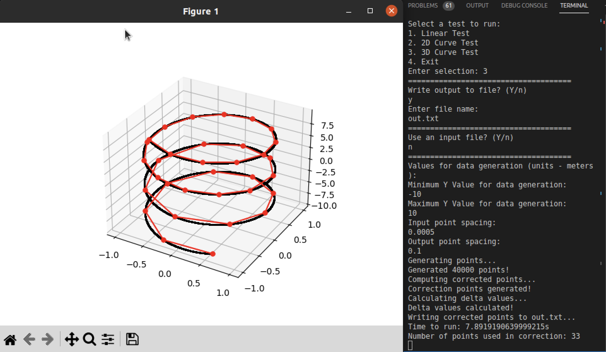
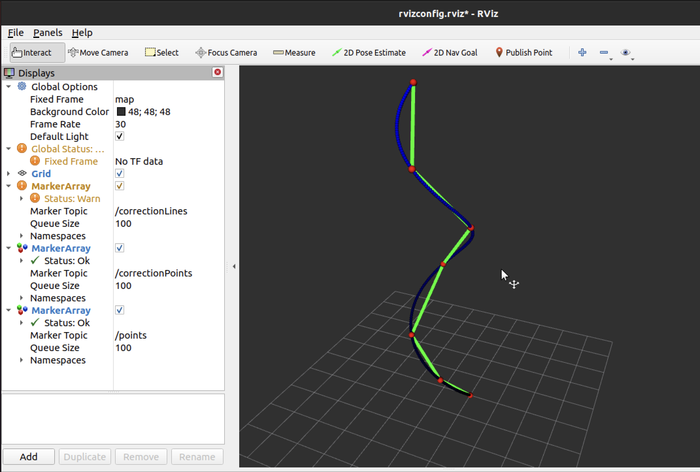

# Points Testing

## Workspace Setup

  
Clone this repo into the src folder of your catkin workspace. 
  
Create a new virtual enviroment with: <code>python -m venv venv</code>
and activate it with <code>source venv/bin/activate</code>

Now install the required packages using <code>pip install -r requirements.txt</code> and install any other required packages that come up
  

## Running Scripts

Source the virtual enviroment using <code>source venv/bin/activate</code> 

Args for both launch files:

inputFile - (string) the input file name (not the path). The path of the file should be points_data/[fileName]

outputFile - (string) the output file name (not the path). The file will be created as points_data/[fileName]

outPointSpacing - (double) the maximum distance that the line between two corrected points can vary from the original points

  

To run the MatPlotLib calculations run <code>roslaunch points_terminal.launch [args]</code> (located in the launch folder)
 
To run the RVIZ calculations do <code>roslaunch points_rviz.launch [args]</code> (located in the launch folder)

 

<table>
  <tr>
    <td valign="top"></td>
    <td valign="top"> </td>
  </tr>
</table>

More images shown in docs

